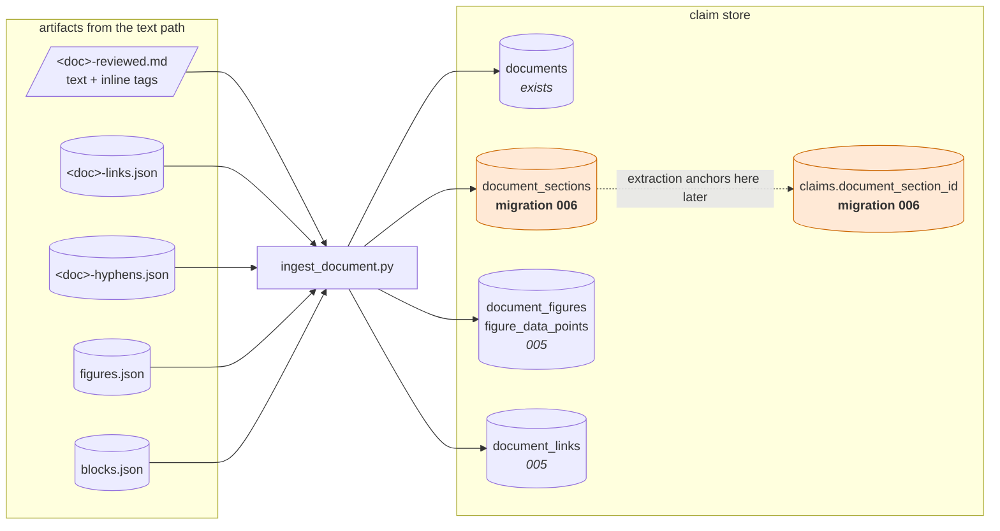

# `ingest_document.py` — build plan

Takes a gated conversion and writes it into the claim store. **No LLM.** Everything here is
deterministic; the judgement already happened upstream and is recorded in the artifacts
this reads.

Read `text-path.md` first — this consumes its output.

---

## What it reads, and what already exists to write into



**Migration 006 is a prerequisite.** 005 built figures and links; sections were planned and
never created. It needs:

```sql
CREATE TABLE document_sections (
    id                  SERIAL PRIMARY KEY,
    document_id         INT NOT NULL REFERENCES documents(id) ON DELETE CASCADE,
    sequence            INT NOT NULL,
    heading             TEXT,
    section_topic       TEXT,
    char_start          INT NOT NULL,
    char_end            INT NOT NULL,
    page_start          INT,
    page_end            INT,
    extraction_tier     CHAR(1) NOT NULL DEFAULT 'C' CHECK (extraction_tier IN ('A','B','C')),
    summary             TEXT,
    content_hash        TEXT NOT NULL,
    parse_confidence    TEXT NOT NULL DEFAULT 'unaudited',   -- vocab
    parse_flags         JSONB,
    parse_reviewed_by   TEXT,
    parse_reviewed_at   TIMESTAMPTZ,
    UNIQUE (document_id, sequence),
    CHECK (char_end > char_start)
);
ALTER TABLE claims    ADD COLUMN document_section_id INT REFERENCES document_sections(id);
ALTER TABLE documents ADD COLUMN converter          TEXT;   -- 'docling+pdfplumber'
ALTER TABLE documents ADD COLUMN converter_version  TEXT;
ALTER TABLE documents ADD COLUMN parse_verdict      TEXT;   -- PASS | REVIEW | REFUSE
ALTER TABLE documents ADD COLUMN parse_override_reason TEXT;
```

Also fix the two nullable-FK defects flagged in review, which bite this corpus specifically
because annual reports are mostly quantities: `quantities.claim_id`,
`fiscal_references.claim_id`, `barriers.claim_id` → `NOT NULL`.

---

## The decision that has to be right first

**What coordinate space do spans live in?**

The markdown contains HTML comments, and two of them change on every run — the generation
timestamp and the gate banner. If a claim's `span_start` is an offset into the markdown
file, then **regenerating the document silently moves every span in the store**.

So:

> Spans are character offsets into the **stripped** text — the markdown with all
> `<!-- … -->` comments and markdown syntax removed (`compare_healed.strip_markup`).
> `documents.content_hash` is the hash of *that* string, not of the file.

This is the same lesson as the checklist's line numbers, one layer down: a line number, a
file offset and a rendered artifact are all **pointers**. The identity is the text. Getting
this wrong is not a bug you notice — every span still round-trips against the file it was
written from, and points at the wrong words in the file you have.

A corollary worth enforcing in code: `ingest` recomputes the hash and **refuses** if it
differs from a hash already stored for that document. A converter change must invalidate
loudly rather than shift silently.

---

## The inline tags are the interface

The renderer emits tags precisely so ingest never has to re-derive judgement. **Parse them;
do not strip them.** Each is a column.

| Tag in the markdown | Means | Becomes |
|---|---|---|
| `<!-- p.N -->` | everything below is page N | `page_start` / `page_end` |
| `<!-- COVERAGE PERIOD: … -->` | the document's own stated period | `covers_period_start/end` |
| `<!-- gate: VERDICT -->` | the conversion's verdict | `parse_verdict` |
| `<!-- FURNITURE: … -->` | a footer or sign-off; asserts nothing | section `extraction_tier = 'C'` |
| `<!-- CAPTION: … -->` | describes an image not retained | tier `C`; never a claim |
| `<!-- ORNAMENTAL FIGURE: … -->` | vision judged it decoration | `document_figures` row, zero data points |
| `<!-- UNEXTRACTED FIGURE: … -->` † | kept, never read | `document_figures` row, `raw_xml` empty, flagged |
| `<!-- recovered by coverage sweep … -->` | placement inferred, not read | `parse_flags.placement_inferred` |
| `[OCR]` / `[text layer]` † | this block's provenance differs from the document's | drives `evidence_grade` |
| `<figure_description>` XML | vision-extracted data | `figure_data_points` |

† Emitted by `render_blocks.py` but absent from the current five documents: every kept
figure has now been read by the vision pass, and no block currently differs from its own
document's dominant source. Both will appear the first time a document is ingested without
its figure stage run, or mixes OCR and text-layer blocks — so ingest must handle them, and
cannot be tested against this corpus alone. Build fixtures for them.

**Three orthogonal signals, none of which deletes anything.** `text_source` says how the
characters were obtained. `FURNITURE` says this text asserts nothing about the world.
`CAPTION` says this text describes an image. A block can be any combination, and ingest
should carry all three rather than collapsing them into one "skip" flag — which is exactly
what caption *deletion* used to do, at the cost of three separate content losses.

---

## Sectioning

Sections are the `##` headings, which are now trustworthy — the heading spines were the
single most-repaired thing in this corpus and are verified against each PDF.

- `heading` — the `##` text.
- `char_start` / `char_end` — offsets in the stripped text, heading inclusive.
- `page_start` / `page_end` — from the surrounding `<!-- p.N -->` markers. These are now
  reliable: an empty marker (one naming a page that carries none of the text under it) is
  no longer emitted.
- `extraction_tier` — `A` where the section contains dollar figures or targets, `B` for
  strategy and GHG sections, `C` for contents, closing, sign-offs and caption-only regions.
  Tier C is never sent for extraction, which is where most of the cost saving lives.
- `parse_confidence` — **defaults to `unaudited`**, and extraction refuses anything that is
  not `clean`. Silence is never evidence of a clean parse.

---

## Learnings from the conversion work, and what each one changes here

These are not general principles; each is a specific thing that went wrong and the specific
design decision it forces.

**1. A check that counts things cannot see wrong order.**
Year 3 shipped two sentences woven together — `EnhaEnNciHngA NthCeE` — through a gate whose
every check was quantitative. The characters were all present, the count was right, the
span round-tripped.
→ Ingest gets a **plausibility check of its own**, not just referential integrity: reject a
section whose text contains a `garbled_text` token, and a `verbatim` that fails the same
test, before any of it reaches a claim.

**2. Deterministic evidence outranks a model's proposal — and merges lose that quietly.**
Merging model-anchored links on `(uri, page)` overwrote six string-matched anchors, two
with a materially different sentence.
→ Every table ingest writes carries **how the value was obtained** (`extracted_by`,
`anchored_by`, `text_source`). An upsert must never let a lower-provenance row replace a
higher one; make that a constraint or a guarded function, not a convention in a script.

**3. Tag, never delete.**
Caption deletion was the single most dangerous mechanism in the conversion pipeline, and
every guard added to it was correct and insufficient.
→ Ingest **stores ornamental figures, unanchored links and furniture blocks**. A row with a
verdict recorded is auditable; an absent row is indistinguishable from one that was never
seen.

**4. A stage that runs per-document must run for every document.**
`extract_links` existed for weeks while four of five documents carried 198 uncollected
hyperlinks.
→ Ingest **refuses a document whose sidecars are missing** rather than ingesting the parts
it happens to find, and reports per-document coverage: sections, figures, links, rulings.

**5. A derived artifact stops being derived the moment a human annotates it.**
Regenerating the review checklist destroyed a completed review, unrecoverably, because
`processing/` was untracked.
→ The review workbook that comes out of ingest needs the same guard as
`review_checklist.write_checklist`: refuse to overwrite a file carrying human marks, write
alongside, and say so loudly.

**6. Report the source as it is; flag, do not repair.**
Years 3 and 4 state coverage periods of 337 and 338 days because both print "June 3" where
the page means June 30. Verified against the content stream — it is the source's typo.
→ `covers_period_start/end` are stored **verbatim as parsed**, with a `parse_flags` entry
when the period is not within a few days of a year. The correction is a curator's ruling
recorded against the document, never an edit at ingest.

**7. Measure the population before writing the rule.**
Every rule that survived this conversion was measured across all five reports first. The
one time I built before measuring (a blanket re-sort by vertical position) it would have
damaged five documents to fix neither reported case.
→ Before each tier heuristic and each `parse_confidence` rule ships, print how many
sections it touches across the corpus, and what they are.

---

## Build order

Each step is inspectable before the next costs anything.

1. **Migration 006** + the nullable-FK fixes. `tests/test_schema_runtime.py` applies the
   full DDL on every run, so this is verified continuously.
2. **`strip_markup` → canonical text + hash.** Prove `text[span_start:span_end]` round-trips
   for a hand-built span on every one of the five documents. This is the load-bearing step;
   nothing else matters if the coordinate space is wrong.
3. **Tag parsing.** One function per tag returning structured records. Test against all five
   markdowns — the corpus already contains every tag type.
4. **`--dry-run` sectioning.** Print sections with tier, pages and char range. Expect ~10–14
   per report, most tier B. Eyeball against the PDFs before writing a row.
5. **Write `documents` + `document_sections`.** Idempotent on `(document_id, sequence)`;
   refuse on a `content_hash` mismatch.
6. **Load the sidecars** into `document_figures`, `figure_data_points`, `document_links`.
   These tables already exist, so this is the cheapest real end-to-end test.
7. **Gate.** Refuse `parse_verdict = REFUSE` without an explicit override recorded on the
   document. Year 3 was REFUSE for a day; that is the fixture.

**Done when:** all five reports ingest; every stored span round-trips against the recorded
hash; ornamental figures and unanchored links are present with their verdicts rather than
missing; and re-running ingest on an unchanged document is a no-op while re-running it on a
re-converted one refuses.

Claim extraction is the next thing after this, and it does not start until a hand-read of
one tier-B section finds no claim that misrepresents its source.
