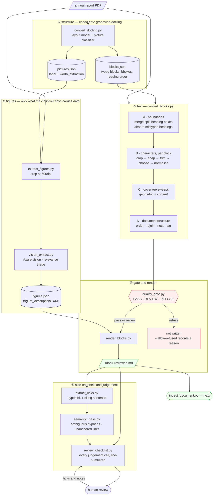
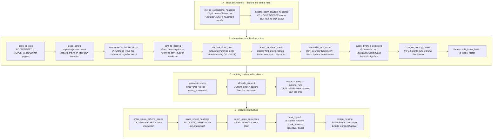

# The text path: PDF → review-grade markdown

How an annual report becomes text a claim can be anchored to, and why each step exists.

Every stage here was added because a real document broke without it. Where a step looks
fussy, the defect it prevents is named — those are the parts to read.

---

## The founding constraint

> **Docling proposes block boundaries and reading order; pdfplumber supplies the exact
> characters.**

Two readers, each authoritative for a different thing. Docling reads the *rendered page* —
it knows a heading from a caption, and which column continues into which. pdfplumber reads
the *character stream* — it knows exactly which glyphs are there. Neither alone is enough:

- pdfplumber alone loses **92% of Year 2** (an image-based PDF) and every dollar figure in
  it, exiting cleanly with no error.
- Docling alone fragments styled runs — it reads `A²ZERO` as `A 2 ZERO` on 40 of Year 5's
  53 occurrences.

Where they disagree, the rule is decided per property, never per document, and each such
decision is a named function in `convert_blocks.py`.

---

## Stage map



---

## Inside `convert_blocks.convert()`

The 25 steps, in the order they run. Each names the document that forced it.



### The three rules these steps keep

| Rule | Why | Where it bit |
|---|---|---|
| **Tag, never delete** | A misjudgement becomes mislabelled, not missing — visible and recoverable | Caption deletion cost three content losses before it was removed as a mechanism |
| **Fail closed** | Silence is not evidence of a clean parse | Every failure so far produced valid-looking output and no error |
| **Document-internal evidence over tuned thresholds** | A threshold that fits this corpus is a guess about the next one | `_INDENT_STEP=24` missed an 18.4pt indent; ems and per-page column tests replaced it |

---

## What the gate checks

`quality_gate.py` returns **PASS**, **REVIEW** or **REFUSE**. Refusing does not write the file.

| Check | Severity | Catches |
|---|---|---|
| `text_recovery` | HIGH | the converter lost the document |
| `numeric_conservation` | HIGH | a figure present in one read, absent in the other |
| `span_round_trip` | HIGH | offsets that do not return their own text |
| `page_map` | HIGH | non-monotonic or missing page mapping |
| `garbled_text` | HIGH | **two text runs interleaved** — see below |
| `truncation` | MEDIUM | a block ending on a dangling word |
| `ocr_fraction` | MEDIUM | how much of this document is a model's reading of pixels |

`garbled_text` is the one worth understanding, because it is the only check that asks
whether the output is **plausible** rather than **complete**. Every other check counts
things, and a block whose characters are perfectly preserved but in the wrong *order*
passes all of them — right length, right numbers, span round-trips exactly. Year 3 shipped
`EnhaEnNciHngA NthCeE rTeHsiEli` through a clean gate and a 135-item checklist. English
words do not alternate case internally; the check is one line and fires on 13 tokens in the
broken document and none in the other four.

---

## Where the model is allowed to speak

Three places, each with a mechanical guard that makes fabrication structurally impossible
rather than merely discouraged.

| Stage | The model proposes | What decides |
|---|---|---|
| `vision_extract` | data points read off a chart, and a `relevance` verdict | `worth_extraction` gates the call; an `ornamental` verdict renders no data |
| `semantic_pass` — hyphens | `join` or `hyphen` | the answer must be **one of exactly two strings** the split itself produced |
| `semantic_pass` — links | the sentence citing a URL | must be found **character-for-character**; offsets come from that search |

The worst case for `semantic_pass` is that it changes nothing. It cannot put a word in the
document the document does not contain.

**What deliberately does not reach it.** Every conversion defect in this corpus had a
mechanical cause — a 2pt pad, spaces on their own baseline, a bullet encoded as `o`, a
heading inside a photograph. A model asked to clean that up would have written plausible
text over all of it and hidden the fact that the geometry was wrong.

---

## Running it

```bash
# ① structure (separate env — torch + docling)
conda run -n grapevine-docling python -m pipeline.convert_docling \
  --pdf <in.pdf> --out <work>/doc

# ② figures — only if pictures.json marks something worth extracting
python3 -m pipeline.extract_figures \
  --pdf <in.pdf> --pictures <work>/doc.pictures.json --out-dir <work>/figs

# ③④ text, gate, render
python3 -m pipeline.orchestrate_blocks \
  --pdf <in.pdf> --blocks <work>/doc.blocks.json \
  --figures-json <work>/figs/figures.json --page-markers \
  --title "<name>" --out processing/<doc>/orchestrated/<doc>-reviewed.md

# ⑤ side-channels — run these for EVERY document, not just the first
python3 -m pipeline.extract_links --pdf <in.pdf> --blocks <work>/doc.blocks.json \
  --out processing/<doc>/links/<doc>-links.json
python3 -m pipeline.semantic_pass --pdf <in.pdf> --blocks <work>/doc.blocks.json \
  --links processing/<doc>/links/<doc>-links.json \
  --hyphens processing/<doc>/links/<doc>-hyphens.json
python3 -m pipeline.review_checklist --pdf <in.pdf> --blocks <work>/doc.blocks.json \
  --md processing/<doc>/orchestrated/<doc>-reviewed.md \
  --rulings processing/<doc>/links/<doc>-hyphens.json \
  --label "<name>" --out processing/_review/REVIEW_CHECKLIST.md
```

> `extract_links` was written while Year 5 was the only converted document and was never
> re-run as the others landed. Years 2–4 carried 198 uncollected hyperlinks for weeks. A
> stage that runs per-document needs running for every document.

---

## Current state of the A2Zero corpus

| | words | healed ref | headings | gate | links anchored |
|---|---|---|---|---|---|
| Year 1 | 1,381 | 1,372 | 9 | REVIEW | — (PDF has none) |
| Year 2 | 3,178 | 3,108 | 9 | REVIEW | 21/21 |
| Year 3 | 4,646 | 4,602 | 12 | PASS | 46/49 |
| Year 4 | 5,605 | — | 12 | PASS | 81/83 |
| Year 5 | 7,594 | — | 12 | PASS | 81/81 |

Corpus-wide: 0 garbled tokens, 0 orphaned bullet glyphs, 0 open sentences, 0 empty page
markers, 14 ambiguous hyphens ruled, 229/234 links anchored. Years 1 and 2 sit at REVIEW on
OCR fraction and word-count delta, not on defects.
